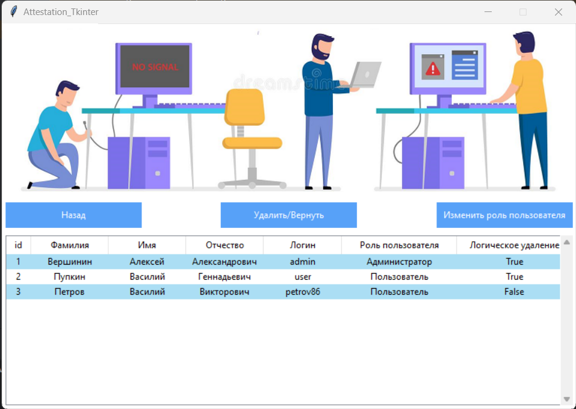
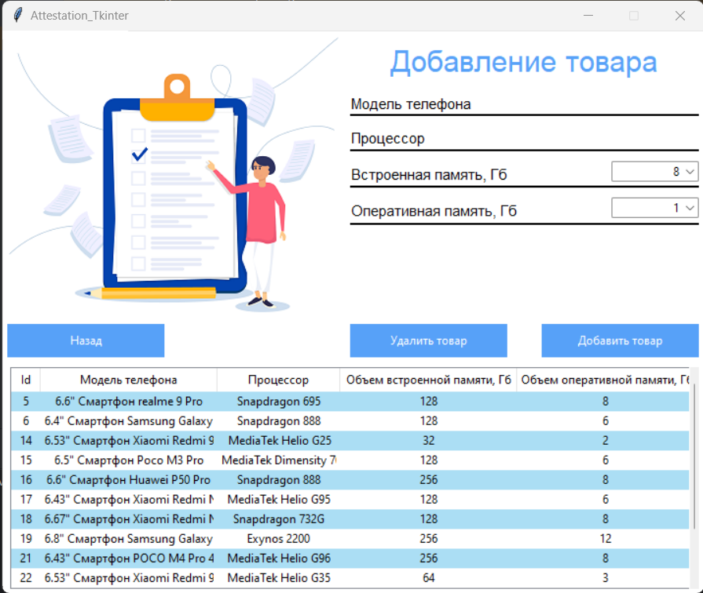

# phone_sale_tkinter
Intermediate certification work on creating a Python desktop application using the tkinter library and a Postgresql relational database.

### Assignment for intermediate certification

It is necessary to develop a (console/desktop) application for the sale of phones. 

* The system must have the following roles: administrator and store visitor. To interact with the tables of users and phones, you can create separate modules. 

* Users have a footprint. attributes: full name, login, password, role, logical deletion (exist, with data type bool).

* Phones have a footprint. attributes: name, number of memory, number of RAM, processor.

* When the application starts, a menu with a choice of actions should be displayed: 1 – log in, 2 – register

* The user can log in with a username and password. The entered data is checked from the User table in the database. If the user does not logically exist (exist == false), then the user cannot log in.

* If the user has logged in as a visitor, the functionality of viewing available phones for purchase is available to him.

* If the user has logged in as an administrator, the functionality of adding products, deleting products, viewing user information, changing the role of the user is available to him.

* By default, all users are registered as visitors. The role of the visitor can only be changed by the administrator.

* Registration data: Last name, first name, patronymic, login, password.

* You should also add exception handlers and data validation.

### Installation

* Clone the repository using the command in the terminal `git clone https://github.com/alexeyvershinin/phone_sale_tkinter.git` or download the archive from the [link](https://github.com/alexeyvershinin/phone_sale_tkinter/archive/refs/heads/main.zip)

* Install all the necessary dependencies from the file `requirements.txt` using command `pip install -r requirements.txt`

* Since the application was written for use with the Postgresql database, you must install this database, you can download it from the official [website](https://www.postgresql.org/) I used postgresql 14.

* Сreate a database with any name convenient for you and enter the connection parameters in the program block
```python
    def connection_postgre(self):
        global connection
        try:
            connection = psycopg2.connect(
                database='attestation',
                user='postgres',
                password='password',
                host='127.0.0.1',
                port='5432'
            )
        except psycopg2.OperationalError as e:
            messagebox.showwarning("Error\n", e)
```
* For your convenience, I have included a database dump file in the repository `dump_db.sql`. Open the created database in pgAdmin, right-click and select Query Tool. In the tab that opens, click open file and select dump_db.sql after that, you just have to run the query.

* In the provided dump, the login `admin` and password `P@ssw0rd` are set by default for the administrator. You can create a user and change the value to `1` in the `role_user` column, after that your user will become an administrator.

* If you don't want to use my database dump, you can create your own. To do this, run the following query in the created database
```sql
-- Creating a Role Table
CREATE TABLE IF NOT EXISTS role_of_users 
(
  id_role serial PRIMARY KEY,
  role varchar(50) NOT NULL
);
```
```sql
-- Filling in the User Role table
INSERT INTO role_of_users
(role) VALUES
('Администратор'),
('Пользователь');
```
```sql
-- Creating the Users table
CREATE TABLE IF NOT EXISTS users 
(
  user_id serial NOT NULL,
  lastname varchar(50) NOT NULL,
  firstname varchar(50) NOT NULL,
  patronymic varchar(50) NOT NULL,
  login varchar(50) NOT NULL,
  password varchar(150) NOT NULL,
  role_user integer NOT NULL REFERENCES role_of_users(id_role),
  exist bool default TRUE NOT NULL
);
```
```sql
-- Creating a Phone Table
CREATE TABLE IF NOT EXISTS phone 
(
  id_phone serial NOT NULL,
  model varchar(50) NOT NULL,
  processor varchar(50) NOT NULL,
  memory integer NOT NULL,
  ram integer NOT NULL
);
```
* Go to the folder with the downloaded repositories and run the `phone_sale.py` file in the terminal with the command `python phone_sale.py` or in your favorite IDE.

### Screenshots of the application

main screen


register page


user page



phone page


